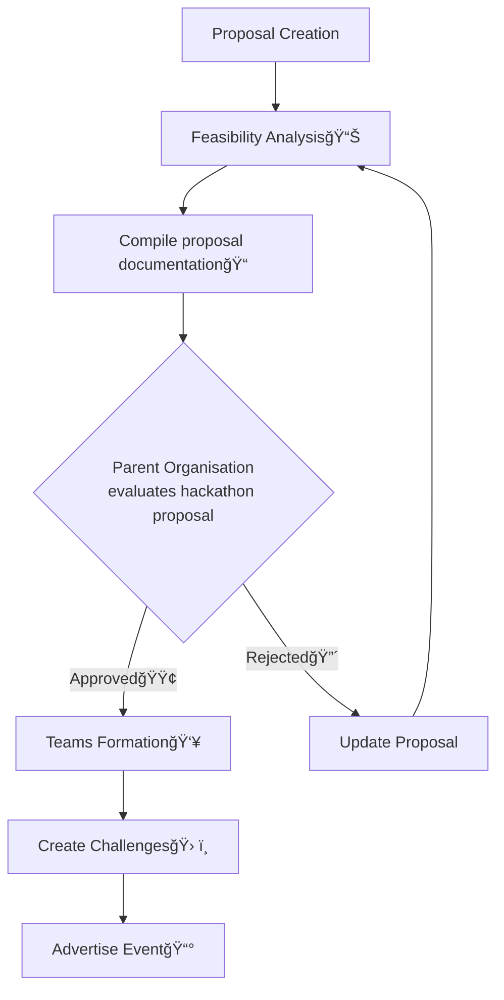

```mermaid
graph TB
    %%Node definition
        CreateChallenge[Create Challenge]
        ChallengeUpdate[Challenge Update]
        FollowGuidelines[Follow Guidelines]
        CouncilApproval{Council Approval}
        AddChallenge[Add Challenge]
        PlayTest[Play Test]
        PlayTestResult{Play Test Result}

    CreateChallenge[Create a new Challenge]-->FollowGuidelines[Apply predefined rules<br>on challenge creation]
    FollowGuidelines-->CouncilApproval{The Council<br>evaluates the Challenge}

    %%Challenge Acceptance
        CouncilApproval --> |Accepted🟢| PlayTest
        CouncilApproval --> |Rejected🔴| CreateChallenge
        CouncilApproval --> |Changes Needed🟡| ChallengeUpdate[Update the Challenge]
    
    ChallengeUpdate --> FollowGuidelines
    %%Play Test
        PlayTest[A diverse play testers<br>play tests the challenge] --> PlayTestResult{Result of Play Test}
        PlayTestResult --> |Positive🟢| AddChallenge
        PlayTestResult --> |Negative🔴| CouncilApproval

```

# Cyber-Security Hackathon
`ReadMe Last updated on: 2024/07/05 (YYYY/MM/DD)`

## Table of Content
| Content                                                       |
| ---                                                           |
| [Introduction](#content-introduction)                         |
| 🧭[Repository Navigation](#content-repositorynavigation)      |
| 🛣️[Hackathon FlowChart](#content-hackathonflowchart)          |
| 🦮[Guidance](#content-hackathonguidance)                      |

---
## 
Introduction

This is a Repository that will contain all the resources and assets for the Cyber-Security Hackathon `Coolness` hosted by the `Department of Coolness` of the `College of Coolness, Shillong, Meghalaya`

---
## 
Repository Navigation🧭

### [Challenges🪨][DirectoryLink Challenges]
- #### OSINT
- #### Digital Forensics
- #### Miscellaneous
### [Rules and Regulations⚖️][DirectoryLink-RulesAndRegulations]
- #### [Entry Requirement][DirectoryLink EntryRequirement]
- #### [Adding Challenges][DirectoryLink AddingChallenges]
- #### [Repository][DirectoryLink_Repository]
### [Hackathon Management💼][DirectoryLink HackethonManagement]

---
## 
Hackathon FlowChart

### Table of Content
| Content                                               |
| ---                                                   |
| 🦅[Birds Eye View](#mermaid-birdseyeview)
| 🛠️[Creating Challenges](#mermaid-creatingchallenges)    |
### 
Birds Eye View🦅:

### 
Creating Challenges🛠️:

---
## 
Hackathon Guidance🦮

### Over-View
- By [Hackerearth][WebLink Hackerearth_HowToOrganizeAHackathon]

<!--MarkDown Document Links-->

<!--Folder: Challenges-->
[DirectoryLink Challenges]: ./Challenges/

<!--Folder: Rules and Regulation-->
[DirectoryLink-RulesAndRegulations]: ./Rules%20and%20Regulations/
[DirectoryLink EntryRequirement]: ./Rules%20and%20Regulations/Entry%20Requirement.md
[DirectoryLink AddingChallenges]: ./Rules%20and%20Regulations/Adding%20Challenges.md
[DirectoryLink_Repository]: ./Rules%20and%20Regulations/Repository.md

<!--Folder: docs-->
[DirectoryLink HackethonManagement]: ./docs/Hackathon%20Management.md

<!--Guidance Links-->
[WebLink Hackerearth_HowToOrganizeAHackathon]: https://www.hackerearth.com/community-hackathons/resources/e-books/guide-to-organize-hackathon/